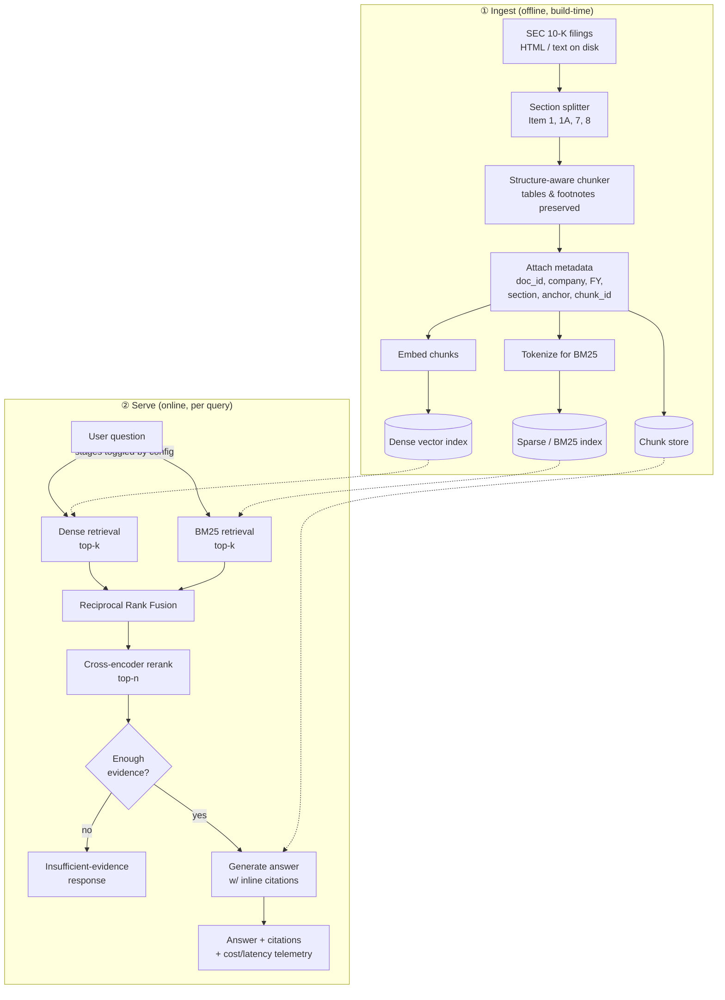
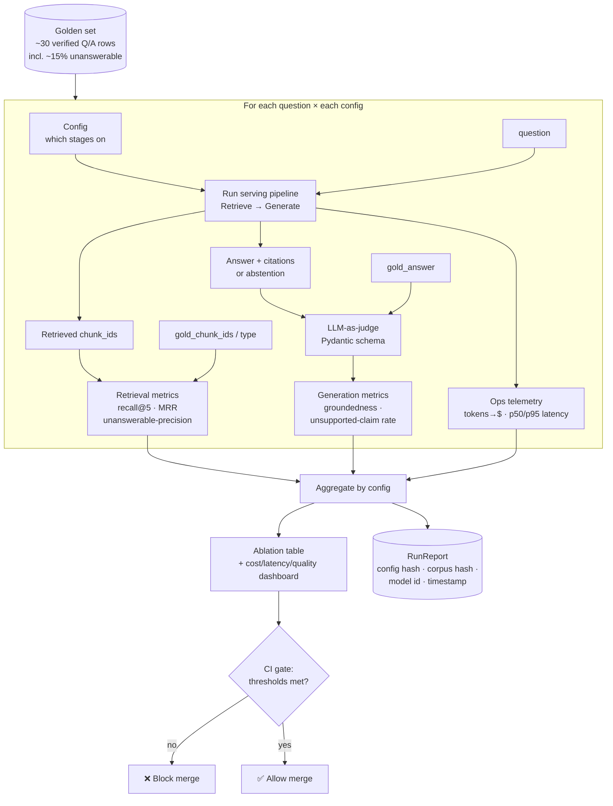

# RAGauge — Design Document

> **Working title:** RAGauge — *"measure your RAG."*
> An **eval-first** retrieval-augmented QA system over SEC 10-K filings. The
> headline feature is not the chatbot — it is the **evaluation harness**: a
> hand-verified golden set, retrieval + groundedness metrics, an ablation that
> proves every retrieval stage earns its complexity, a cost/latency/quality
> dashboard, and a CI gate that blocks quality regressions.
>
> **Portfolio thesis:** *I can make an LLM system measurably reliable, and prove
> it with numbers.*

This document is written from three simultaneous perspectives:

1. **Software architect** — component boundaries, data flow, where state lives.
2. **RAG engineer** — chunking, hybrid retrieval, grounding/citation, the
   "insufficient evidence" path.
3. **Hiring manager** — what is portfolio signal vs. table stakes, and what an
   interview panel will probe.

No implementation code appears here by design — planning precedes code.

---

## Table of contents

1. [Goals, non-goals, and the bet](#1-goals-non-goals-and-the-bet)
2. [System architecture (architect view)](#2-system-architecture-architect-view)
3. [End-to-end pipeline diagram](#3-end-to-end-pipeline-diagram)
4. [Ingest: structure-aware chunking (RAG engineer view)](#4-ingest-structure-aware-chunking-rag-engineer-view)
5. [Retrieve: hybrid retrieval (RAG engineer view)](#5-retrieve-hybrid-retrieval-rag-engineer-view)
6. [Generate: grounding, citations, and insufficient evidence](#6-generate-grounding-citations-and-insufficient-evidence)
7. [Eval harness: the headline](#7-eval-harness-the-headline)
8. [Eval-harness flow diagram](#8-eval-harness-flow-diagram)
9. [Where state lives](#9-where-state-lives)
10. [Configuration & ablation model](#10-configuration--ablation-model)
11. [Tech choices](#11-tech-choices)
12. [Build order & milestones](#12-build-order--milestones)
13. [Hiring-manager review](#13-hiring-manager-review)
14. [Risks & open questions](#14-risks--open-questions)

---

## 1. Goals, non-goals, and the bet

### The bet
Most RAG portfolio projects are a thin wrapper over a vector DB and an LLM call.
They demo well and prove nothing. RAGauge inverts the emphasis: **the QA system
is the test subject; the eval harness is the product.** Every architectural
decision is made so a stage can be *turned off, measured, and judged on whether
it earned its complexity.*

### Goals
- Correct, **grounded** answers over messy 10-K filings, with inline citations.
- A **labeled golden set** and a metrics suite that scores retrieval *and*
  generation without hand-waving.
- An **ablation** demonstrating the marginal lift of BM25, fusion, and rerank.
- A **cost/latency/quality** view so trade-offs are explicit, not vibes.
- A **CI gate** that fails the build when quality regresses below thresholds.

### Non-goals (MVP)
Live EDGAR ingestion, a polished UI, multi-tenant infra, fine-tuning, agentic
multi-tool planning. Reliability and measurement are the point, not breadth.

### Operating principles
- **MVP first, dense-only first, static data first.** Earn each layer.
- **Everything modular and config-toggleable** so retrieval stages ablate cleanly.
- **Plan before code.** This doc + the PRD precede implementation.
- **One repo, reproducible runs.** A run is identified by config + corpus hash.

---

## 2. System architecture (architect view)

RAGauge is four bounded components plus a thin orchestration seam. The hard rule:
**data crosses boundaries as typed records, never as hidden global state.** Each
component is independently testable and independently replaceable.

### 2.1 Component boundaries

| Component | Responsibility | Input → Output | Owns |
|---|---|---|---|
| **Ingest** | Parse filings into structure-aware chunks with metadata | raw filing files → `Chunk[]` + indexes | Chunk schema, parsing, index build |
| **Retrieve** | Turn a query into ranked, deduped evidence | `query, config` → `RetrievedChunk[]` | Sparse/dense/fusion/rerank stages |
| **Generate** | Produce a grounded, cited answer or abstain | `query, RetrievedChunk[]` → `Answer` | Prompt, citation contract, abstention |
| **Eval harness** | Score the pipeline against the golden set | `golden set, pipeline, config` → `RunReport` | Metrics, judge, dashboard, CI gate |

The first three form the **serving pipeline** (the system under test). The fourth
**wraps** the pipeline and treats it as a pure-ish function:
`answer = pipeline(question | config)`. That framing is the whole design — the
serving pipeline is deterministic given a config and corpus, so the harness can
attribute every quality delta to a config change.

### 2.2 The orchestration seam
A single `Pipeline` object composes Retrieve → Generate behind one call. The eval
harness and any future CLI/API talk **only** to this seam, never to internal
stages. This keeps the system-under-test swappable: the harness doesn't know or
care how many retrieval stages ran.

### 2.3 Data contracts (the types that cross boundaries)

- **`Chunk`** — `doc_id, company, fiscal_year, section, anchor, chunk_id, text`.
  The atomic unit of evidence. `chunk_id` is **stable and content-addressed** so
  citations and golden labels survive re-ingestion.
- **`RetrievedChunk`** — a `Chunk` plus `score`, `stage_provenance` (which
  stage(s) surfaced it and at what rank), and fused/rerank scores.
- **`Answer`** — `text, citations: chunk_id[], abstained: bool, evidence_used`,
  plus token/cost/latency telemetry.
- **`GoldRow`** — `id, question, gold_answer, gold_chunk_ids, type, difficulty`.
- **`RunReport`** — per-question results + aggregate metrics + run metadata
  (config hash, corpus hash, model id, timestamp, cost).

> **Architect signal:** the metadata schema is load-bearing. `chunk_id` stability
> and `stage_provenance` are what make citations trustworthy and ablations
> attributable. Get these wrong and the eval harness measures noise.

### 2.4 Data flow (textual)

```
filings/ ──ingest──▶ chunks + (dense index, sparse index) ──┐
                                                            │
question ──▶ Retrieve(config) ──▶ RetrievedChunk[] ──▶ Generate ──▶ Answer
                                                            │
golden set ──▶ Eval harness ──▶ RunReport ──▶ dashboard + CI gate
```

State is written at two moments only: **ingest** (build indexes) and **eval run**
(persist `RunReport`). Serving a single question is otherwise stateless.

---

## 3. End-to-end pipeline diagram



*Each serve-stage is independently toggleable. Dashed arrows are reads from
persisted state; solid arrows are the per-query data path.*

---

## 4. Ingest: structure-aware chunking (RAG engineer view)

10-Ks are adversarial input: HTML or near-plaintext, enormous numeric tables,
dense footnotes, and a rigid but inconsistently formatted **Item** structure
(Item 1 Business, Item 1A Risk Factors, Item 7 MD&A, Item 8 Financial
Statements). Naive fixed-size character chunking destroys exactly the structure
that makes the answer findable.

### 4.1 Strategy: structure-first, then size-bounded
1. **Section segmentation first.** Split on Item boundaries using anchor/heading
   detection before any size-based splitting. Section identity (`section`) becomes
   first-class metadata and a retrieval filter. A question about risk factors
   should never be answered from the MD&A.
2. **Respect semantic units within a section.** Chunk on paragraph/clause
   boundaries; never split mid-sentence or mid-row.
3. **Tables are special.** Do not blindly flatten a financial table into prose
   that strands a number from its column/row label. MVP approach: keep a table
   (or a coherent table region) as a single chunk with a short caption/context
   header so "$X" stays attached to "Total revenue, FY2023." Oversized tables
   split on row groups, repeating the header context in each piece.
4. **Footnotes travel with their referent** where detectable, so a citation isn't
   to an orphaned footnote.
5. **Size bounds with overlap.** Within those rules, target a token budget per
   chunk with modest overlap to preserve cross-boundary context — overlap tuned,
   not assumed, and validated by the eval harness.

### 4.2 Metadata schema (target)
`doc_id, company, fiscal_year, section, anchor, chunk_id`

- `anchor` — a human-meaningful locator (section + offset/heading) so a citation
  points somewhere a human can verify in the source.
- `chunk_id` — **stable, content-derived** so re-ingestion doesn't invalidate
  golden labels or break historical `RunReport`s.

### 4.3 Why this is signal
Anyone can call a recursive character splitter. Demonstrating that you *looked at
the documents*, found the table/footnote/section failure modes, and chunked to
preserve grounding — then **proved the chunking choice with retrieval recall** —
is the difference between "used RAG" and "engineered RAG."

> **Interview probe to expect:** *"Walk me through one chunk that a naive splitter
> would have broken, and show the recall difference."* Have a concrete example.

---

## 5. Retrieve: hybrid retrieval (RAG engineer view)

Retrieval is staged, and **every stage is config-toggleable** so the ablation can
isolate its contribution. The build order deliberately starts dense-only so the
baseline is honest before complexity is added.

### 5.1 Stages

1. **Dense (embeddings).** Semantic similarity over the vector index. Strong on
   paraphrase and conceptual questions ("how does the company describe supply-chain
   risk?"). Weak on exact tokens — ticker symbols, line-item names, precise
   figures.
2. **Sparse (BM25).** Lexical match. Strong exactly where dense is weak: exact
   financial terms, defined entities, numbers. 10-Ks are full of precise jargon,
   so BM25 is expected to pull real weight here — a hypothesis the ablation tests.
3. **Reciprocal Rank Fusion (RRF).** Combine dense and sparse rankings by rank,
   not by raw score, sidestepping the score-normalization problem between two
   incomparable scoring spaces. Robust, parameter-light, a strong default.
4. **Cross-encoder rerank.** Re-score the fused top-k with a query-aware
   cross-encoder for final top-n precision. Expensive per pair, so it runs **last,
   on a short list** — a deliberate latency/quality trade the dashboard surfaces.

### 5.2 Flow
`query → {dense top-k, BM25 top-k} → RRF → fused top-k → cross-encoder rerank →
top-n → evidence-sufficiency gate → Generate`

Each arrow is a toggle. The ablation matrix runs: dense-only → dense+BM25+RRF →
+rerank, reporting **recall@5, MRR, and recall lift per stage**. A stage that
doesn't move the metrics gets cut — and saying so in the writeup is itself signal.

### 5.3 Why staged + toggleable
The point isn't "more stages = better." It's that **you can prove which stages
earn their cost.** A panel is far more impressed by "rerank added +0.08 recall@5
for +180ms p95, here's the table" than by an unexamined four-stage stack.

> **Interview probe:** *"When does BM25 beat dense here, and when does rerank not
> pay for itself?"* The ablation table is your answer.

---

## 6. Generate: grounding, citations, and insufficient evidence

### 6.1 Grounding contract
The generator answers **only** from retrieved evidence and must attach **inline
citations to `chunk_id`s** for every supported claim. The prompt enforces:
- Use only the supplied chunks; do not rely on parametric/world knowledge.
- Cite the specific `chunk_id`(s) backing each claim.
- If the evidence doesn't support an answer, **abstain explicitly** rather than
  guess.

### 6.2 The "insufficient evidence" path
This is a **first-class outcome, not an error**, and it has two triggers:

1. **Pre-generation gate (retrieval-side).** If the reranked evidence is too weak
   (e.g., top scores below threshold, or no chunk from a plausibly-relevant
   section), short-circuit to an abstention *before* spending a generation call.
2. **Post-generation honesty (LLM-side).** Even with retrieved chunks, the model
   may correctly conclude the specific figure/claim isn't actually present and
   abstain.

Abstention returns a structured `Answer` with `abstained = true` and no
fabricated citations. This directly serves the **unanswerable** golden-set bucket
(~15% of rows) and is scored by **unanswerable-precision** — *no LLM judge
needed*, which is a clean, cheap, honest metric.

### 6.3 Why this is portfolio signal
Knowing when **not** to answer is the single most under-built capability in demo
RAG systems and the one production teams care about most. A system that
hallucinates a confident wrong revenue number is worse than useless in a finance
context. RAGauge treats "I don't have evidence for that" as a feature with its own
metric.

> **Interview probe:** *"How do you stop it inventing a number that sounds right?"*
> Answer: the dual-trigger abstention path + unanswerable-precision + unsupported-
> claim rate from the judge.

---

## 7. Eval harness: the headline

The harness wraps the serving pipeline and turns a config into a `RunReport`.

### 7.1 Golden set design
~30 hand-verified Q/A pairs. Each row:
`id, question, gold_answer, gold_chunk_ids, type, difficulty`
- **type** ∈ `single_doc | multi_hop | unanswerable`.
- ~**15% unanswerable**; several **multi-hop** (require fusing evidence across
  sections/filings).
- **AI drafts, human verifies every row.** The verification step is the integrity
  guarantee — a golden set the author didn't check is worthless, and saying "I
  verified all 30 by hand" is a credibility signal in itself.

### 7.2 Metrics that matter

**Retrieval (no LLM needed — cheap, deterministic, honest):**
- **recall@5** — did the gold chunks make the top-5?
- **MRR** — how high did the first gold chunk rank?
- **unanswerable-precision** — when the system abstained, was it right to?

**Generation (LLM-as-judge, structured/Pydantic output):**
- **groundedness / supported-claim rate** — fraction of claims backed by a cited
  chunk.
- **unsupported-claim rate** — the hallucination signal; the number that must
  trend to zero.

**Ops:**
- **$ per eval run** — via **provider token-counting**, not a generic tokenizer,
  so cost numbers are real.
- **p50 / p95 latency** — per stage and end-to-end.
- **recall lift per retrieval stage** — the ablation payoff.

### 7.3 LLM-as-judge discipline
The judge emits a **structured, validated schema** (Pydantic), not free-text, so
judgments are parseable and aggregable. Claim-level grounded/unsupported labels
roll up into rates. Judge prompts and schema are versioned with the run so a score
is reproducible. Cheap deterministic metrics (recall, MRR, unanswerable-precision)
are computed **without** the judge so the harness isn't fully hostage to LLM
variance — the judge scores only what genuinely needs semantic judgment.

### 7.4 Ablation table
The deliverable artifact. Rows = retrieval configs (dense → +BM25/RRF → +rerank);
columns = recall@5, MRR, unanswerable-precision, groundedness, unsupported-rate,
$/run, p95. This single table is the thesis made visible: *each stage earns its
complexity, or it's cut.*

### 7.5 CI gate
A GitHub Actions job runs the harness on the golden set and **fails the build** if
metrics drop below thresholds (e.g., recall@5 floor, unsupported-claim-rate
ceiling). This converts "I tested it once" into "regressions can't merge" — the
single most production-credible element of the project.

---

## 8. Eval-harness flow diagram



*Note: cheap retrieval metrics need no LLM; the judge runs only on generated
answers. Both feed one aggregate `RunReport` per config.*

---

## 9. Where state lives

| State | Lifetime | Written by | Read by | Notes |
|---|---|---|---|---|
| Raw filings | Permanent, version-controlled or vendored | Human (download once) | Ingest | Static; no live fetch in MVP |
| Chunk store | Rebuilt on ingest | Ingest | Generate (citation text), Eval | Keyed by stable `chunk_id` |
| Dense vector index | Rebuilt on ingest | Ingest | Retrieve (dense) | Embedding-model-versioned |
| Sparse / BM25 index | Rebuilt on ingest | Ingest | Retrieve (BM25) | Tokenizer-versioned |
| Golden set | Permanent, version-controlled | Human (verified) | Eval | The ground truth; treat as code |
| Config | Per run, version-controlled | Human | All stages, Eval | Hashed into `RunReport` |
| `RunReport`s | Append-only history | Eval | Dashboard, CI | Enables regression tracking |

**Key property:** serving a single question is **stateless** given the indexes.
All mutable state is produced at **ingest** (indexes) or **eval** (`RunReport`s).
A run is fully reproducible from `(config hash, corpus hash, model id)`. There is
no hidden session state, no per-user memory, no cache that could make a metric
unreproducible — deliberate, because the harness's credibility depends on
determinism everywhere except the LLM calls themselves.

---

## 10. Configuration & ablation model

A single declarative config object drives the whole serving pipeline:

- **Retrieval toggles:** `dense` on/off, `bm25` on/off, `fusion` on/off,
  `rerank` on/off; `top_k`, `top_n`, fusion constant, score thresholds.
- **Generation:** model id, judge model id, abstention thresholds, prompt version.
- **Corpus:** which filings are in scope.

The ablation runner is just "iterate configs, run the harness, collect
`RunReport`s, diff." Because the seam is clean (§2.2) and state is reproducible
(§9), **every quality delta is attributable to a config diff** — which is the
entire reason the architecture is shaped this way.

---

## 11. Tech choices

| Concern | Choice | Rationale |
|---|---|---|
| Language | Python | Ecosystem for embeddings, BM25, eval |
| Dense | Embeddings + a vector index | Semantic retrieval |
| Sparse | A BM25 library | Lexical retrieval, exact-term recall |
| Rerank | Cross-encoder | Query-aware final precision |
| Generation + judge | **Latest Claude models** (default to the newest Opus for generation; a fast model such as the latest Haiku is a candidate for the judge to control cost) | Strong grounding + structured output; pick per the cost/quality dashboard |
| Cost accounting | **Provider token-counting API**, not a generic tokenizer | Real $ numbers, not estimates |
| Judge schema | Pydantic | Validated, aggregable judgments |
| Tests + CI | Pytest + GitHub Actions | The regression gate |

> Model selection is itself a measured decision: the cost/quality sweep compares
> models on the same golden set, so "which Claude model for the judge vs. the
> generator" is answered with the dashboard, not a guess. Verify exact current
> model IDs/pricing against the live Claude API reference before wiring them in.

---

## 12. Build order & milestones

Incremental, each milestone independently demoable:

1. **Ingest** → structure-aware chunks + metadata. *(Demo: inspect chunks.)*
2. **Dense retrieval** → top-k for a query. *(Demo: eyeball relevance.)*
3. **End-to-end answer** → grounded, cited answer from dense-only. *(Demo: ask it.)*
4. **Golden set** → ~30 hand-verified rows. *(Artifact: the labeled set.)*
5. **Baseline metrics** → recall@5, MRR, unanswerable-precision, groundedness on
   dense-only. *(Artifact: the honest baseline.)*
6. **Add BM25 + RRF + rerank** → behind toggles. *(Demo: stages turn on/off.)*
7. **Ablation table** → lift per stage. *(Artifact: the thesis table.)*
8. **Model/cost sweep** → $/run, latency, quality across models. *(Artifact: dashboard.)*
9. **CI gate** → thresholds block regressions. *(Artifact: a failing/passing PR.)*

Dense-only-first guarantees an honest baseline before complexity, and makes the
ablation meaningful rather than retrofitted.

---

## 13. Hiring-manager review

### What is genuine portfolio signal
- **Eval-first framing.** Leading with measurement, not the chatbot, is rare and
  immediately reads as "this person has shipped real LLM systems."
- **Ablation that can cut stages.** Willingness to *delete* a stage that doesn't
  pay is senior behavior. It proves the complexity is earned, not cargo-culted.
- **First-class abstention + unanswerable metric.** Demonstrates understanding of
  the failure mode that actually matters in production (confident hallucination).
- **Real cost accounting via provider token-counting.** Most candidates hand-wave
  cost; real $/run from the provider API is a differentiator.
- **CI gate on quality.** Turning evaluation into a merge-blocking gate is the
  most "this is how production works" element in the whole project.
- **Hand-verified golden set.** Owning data integrity, not trusting AI-generated
  labels blindly.
- **Document-aware chunking with proof.** Shows the candidate read the messy
  source and validated the choice with recall.

### What is table stakes (necessary, not differentiating)
- Using a vector DB / embeddings at all.
- BM25 + dense + RRF + cross-encoder is a *standard* hybrid stack — credit comes
  from **proving each stage's lift**, not from listing the stack.
- Inline citations (expected baseline for grounded QA).
- Pydantic-structured LLM-judge output (good practice, now common).

### What an interview panel will probe
1. **"Show me one chunk a naive splitter breaks, and the recall delta."** (§4)
2. **"When does BM25 beat dense here? When does rerank not pay?"** (§5)
3. **"How do you stop it inventing a plausible wrong number?"** (§6)
4. **"Your judge is an LLM — who judges the judge? How do you trust groundedness?"**
   Expect to discuss judge variance, human spot-checks, and why cheap
   deterministic metrics carry the load they can. (§7.3)
5. **"30 questions is small — how do you know it's representative / not overfit?"**
   Expect to discuss coverage by type/section/difficulty and the cost of scaling
   verified labels.
6. **"What's your CI threshold and why that number?"** Expect a defensible floor/
   ceiling tied to baseline + tolerance, not a round guess. (§7.5)
7. **"Where does this break at 10,000 filings instead of 3?"** Honest scaling
   limits: index size, rerank latency, golden-set maintenance. (§14)

### Net read
The design signals an engineer who optimizes for **reliability and evidence**
over surface breadth. The risk is execution: the value is entirely in the harness
and the writeup being real — verified labels, honest baselines, a genuinely
threshold-blocking CI gate, and an ablation that actually cuts a stage if the
numbers say so.

---

## 14. Risks & open questions

- **Golden-set size (30).** Small enough that single rows swing metrics. Mitigate
  with stratified coverage (type × section × difficulty) and report confidence
  caveats rather than over-claiming.
- **Judge reliability.** LLM-as-judge has variance and can be gamed. Mitigate by
  leaning on deterministic metrics where possible, versioning judge prompts, and
  periodic human spot-checks of judge labels.
- **Table extraction fidelity.** Financial tables are the hardest input; getting a
  number attached to its label is the make-or-break for finance QA. May need
  iteration beyond the MVP single-chunk-per-table approach.
- **Section detection robustness.** Item boundaries vary across filers/years;
  brittle heading detection degrades the section filter. Needs validation across
  the 2–3 chosen filings.
- **Cost of the sweep.** Model × config × judge calls multiply quickly; keep the
  golden set small and cache where it doesn't compromise reproducibility.
- **CI runtime/cost.** Full judge-based eval on every PR may be slow/expensive;
  consider a cheap deterministic gate on every PR and the full judged sweep on a
  schedule or label.

---

*This document supersedes the raw build notes. Implementation follows the build
order in §12; no code is written until this design and the PRD are agreed.*
